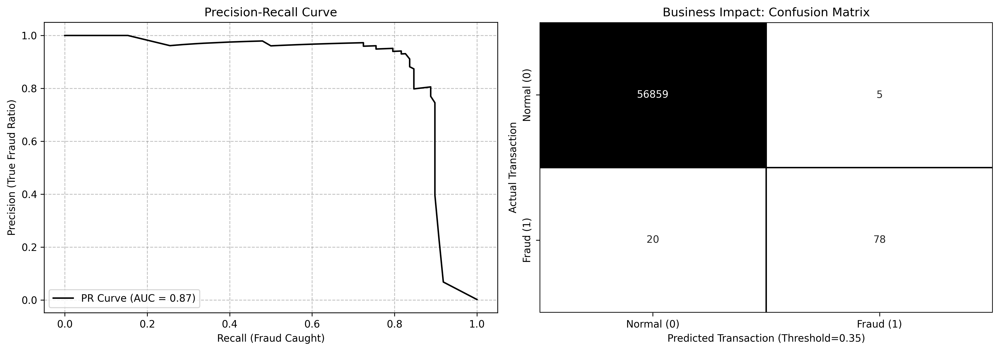

# Credit Card Fraud Detection & Risk Analytics 

## Executive Summary
This project is an end-to-end machine learning pipeline designed to detect fraudulent credit card transactions. In financial risk management, the cost of missing a fraudulent transaction (false negative) must be carefully balanced against the operational cost of investigating normal transactions (false positive). Instead of relying on standard out-of-the-box accuracy, this pipeline optimizes for the **Precision-Recall Area Under Curve (PR-AUC)** to handle extreme class imbalances (0.17% fraud rate). Furthermore, it implements a custom classification threshold strategy to maximize fraud capture while minimizing the manual review burden on risk teams.

## Data Source
* **Dataset:** [Credit Card Fraud Detection (Kaggle)](https://www.kaggle.com/datasets/mlg-ulb/creditcardfraud)
* **Features:** Time, Amount, and 28 anonymized PCA-transformed variables (V1-V28).

## Tech Stack
* **Language:** Python (Pandas, Numpy)
* **Machine Learning:** scikit-learn, Random Forest Classifier
* **Validation:** Stratified 5-Fold Cross-Validation
* **Visualization:** Matplotlib, Seaborn

## Key Results & Model Performance
Because standard ROC-AUC can be misleading on highly imbalanced data, this model was evaluated using PR-AUC via Stratified 5-Fold Cross-Validation to ensure robust generalization.

* **Mean PR-AUC:** 0.8438 (Exceptional precision in identifying the minority class)
* **Recall:** 80% (Successfully blocked 80% of actual fraud)
* **Precision:** 94% (When a transaction was flagged, it was true fraud 94% of the time)

## Business Strategy: Custom Risk Threshold
Default classification models flag fraud at a 50% probability threshold. For this pipeline, the threshold was strategically lowered to **0.35**. 

**Business Impact:**
By adjusting the threshold, the model successfully caught 80% of the fraudulent transactions while generating almost zero false alarms (94% precision). This allows the bank to significantly reduce financial fraud losses without incurring the heavy operational costs of hiring an army of manual reviewers to check thousands of false-positive alerts.

## Visualizations

*Left: Precision-Recall Curve demonstrating model robustness. Right: Confusion Matrix detailing the exact business impact of the 0.35 threshold.*

## How to Clone & Run

**1. Clone the repository:**
```bash
git clone [https://github.com/Akshat-Singh-Kshatriya/credit-card-risk-analytics.git](https://github.com/Akshat-Singh-Kshatriya/credit-card-risk-analytics.git)
cd credit-card-risk-analytics
```
**2. Run the Model**
```bash
python credit_risk.py
```

